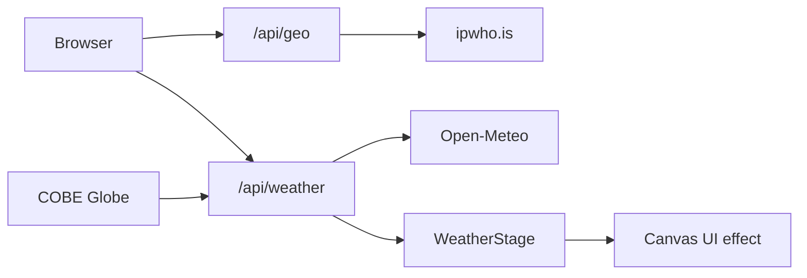

# Cool Canvas Weather App

## Stack

- **Next.js (App Router) + TypeScript + Tailwind CSS + shadcn/ui**
- **Canvas UI** via `npx shadcn@latest add @canvas-ui/*-react`
- **COBE** globe (`cobe`) with markers — not Ruixen
- **Open-Meteo** for weather + reverse geocoding (free, no API key)
- **IP geolocation** via a free server-side call (e.g. `ipwho.is` or `ipapi.co`) from a Next.js route — never prompt the browser for GPS

## Weather → effect mapping

A single `WeatherStage` client wrapper swaps the active Canvas UI effect from WMO weather codes + wind/temp:

| Condition                         | Component   | Notes                               |
| --------------------------------- | ----------- | ----------------------------------- |
| Clear / sunny                     | `Blaze`     | Warm, low-intensity heat shimmer    |
| Hot (≥32°C clear/partly)          | `FlameWrap` | Fire border around the main readout |
| Cloudy / fog                      | `Clouds`    | Mist over the UI                    |
| Rain / drizzle / thunderstorm     | `Droplets`  | Intensity scaled by precip          |
| Snow / freezing                   | `Frost`     | Ice pane over content               |
| Windy (high wind, otherwise mild) | `Cloth`     | Wind-ripple fabric                  |

Effects install from Canvas UI registry into `components/canvasui/`. Only one effect mounts at a time; options (intensity, tint, speed) are driven by live metrics.

## App structure

- `[app/page.tsx](app/page.tsx)` — single composition: atmospheric background, hero brand **betterWeather**, current location weather (temp, condition, wind), effect stage, globe section below fold
- `[app/api/geo/route.ts](app/api/geo/route.ts)` — read client IP from headers (`x-forwarded-for` / `x-real-ip`), resolve city/lat/lon
- `[app/api/weather/route.ts](app/api/weather/route.ts)` — `lat`/`lon` → Open-Meteo current + short forecast; return normalized payload (`temp`, `code`, `wind`, `precip`, `label`, `city`)
- `[lib/weather.ts](lib/weather.ts)` — WMO code → condition bucket + human label; effect picker + option presets
- `[lib/cities.ts](lib/cities.ts)` — ~10–12 major cities with lat/lon for globe pins (NYC, London, Tokyo, Sydney, Dubai, São Paulo, Cairo, Paris, Singapore, LA, Mumbai, Cape Town)
- `[components/weather/WeatherStage.tsx](components/weather/WeatherStage.tsx)` — mounts the correct Canvas UI wrapper around children
- `[components/weather/WeatherPanel.tsx](components/weather/WeatherPanel.tsx)` — location name, big temp, condition, wind/humidity
- `[components/globe/WeatherGlobe.tsx](components/globe/WeatherGlobe.tsx)` — COBE with markers; click pin → fetch that city’s weather and update the stage
- Client state: selected location (IP default, then city pin or search later if easy)

## UX / design

- One first-viewport composition: brand, one headline (condition + place), short supporting line, CTA to scroll/explore globe — no dashboard clutter in the hero
- Atmosphere tied to condition (sky gradients / light direction), not flat fills; expressive typography (not Inter/Roboto)
- Avoid purple-on-white and cream/terracotta AI clichés
- Motion: effect transitions, subtle temp number change, globe marker pulse
- Mobile: stacked layout; globe usable via drag; effects degrade gracefully without html-in-canvas flag

## Globe behavior

- Install/adapt COBE globe with `markers` for major cities
- On pin click: load that city’s weather, update panel + effect, optionally rotate globe toward marker
- Show a small floating readout (city + temp + condition) for the active pin — not a card grid in the hero

## Scaffolding steps (execution order)

1. `create-next-app` in the empty `betterWeather` folder; init shadcn; add `.gitattributes` with `package-lock.json linguist-generated=true`
2. Install Canvas UI: `@canvas-ui/flame-wrap-react`, `frost-react`, `droplets-react`, `clouds-react`, `cloth-react`, `blaze-react`
3. Add `cobe` + WeatherGlobe with city markers
4. Build geo + weather API routes and `lib/weather` mapping
5. Wire page: IP location on load → WeatherStage + panel → globe city switching
6. Polish atmosphere, transitions, responsive layout

## Notes

- Canvas UI full html-in-canvas path needs Chrome flag / origin trial; fallbacks still show WebGL overlays — call this out lightly in UI if needed
- No weather API keys required for MVP (Open-Meteo + free IP geo)
